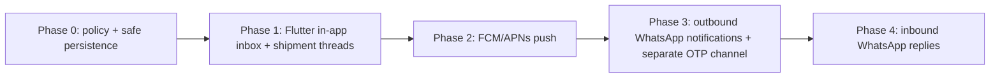

# Notifications and two-way communication implementation plan

**Status:** Phase 0 and the core Phase 1 in-app implementation are on `feat/inapp-notifications-communication`, branched from `origin/main` at `85b7ec5` on 2026-10-05. Final visual review and broader PostgreSQL persistence/performance checks remain release gates.

## Implementation tracking (2026-10-05)

- **Implemented:** Store v6 FILE migration for communications; relational Prisma models and DB load/upsert persistence; non-destructive upserts for shipment, organization, user, and membership parents; RBAC permissions and organization-scoped recipient checks; notification inbox/read API; shipment conversation read/send API with client idempotency, content validation, and a configurable per-user rate limit; in-app event fanout for booking, carrier acceptance, trip start/completion, POD submission/acceptance, payment-status changes, and new messages; recipient-role-specific English copy; configurable terminal reply closure; approved OPS escalation request, approve/deny/revoke, and audited support access; Flutter inbox, unread badge, conversation view, secure scoped drafts, and entry points in shipper/carrier flows.
- **Validated:** Prisma schema validation and generation; TypeScript compile; full API suite passes (206 tests: 205 passed, 1 skipped); 3 focused Flutter widget tests pass; Flutter analysis is clean for the new notification/draft widgets and their tests; `git diff --check` is clean. Regression coverage includes legacy terminal conversations remaining read-only after reads/persistence, and idempotent retry of a committed message after the reply deadline.
- **Validation update (2026-10-07):** a disposable PostgreSQL 16 schema push and grouped-inbox integration test passed, including fixed-watermark paging, late arrivals, and cross-organization isolation. A 100,000-row synthetic `EXPLAIN (ANALYZE, BUFFERS)` query used the recipient/shipment and shipment indexes; this is not production-scale evidence. The full Flutter suite passes (46 tests), Flutter web build passes, and targeted mobile Playwright flow passes. Changed-file Flutter analysis passes; repository-wide analysis exits nonzero on 36 informational lints elsewhere in the app. Browser screenshots still omit Flutter text, so visual sign-off is outstanding.
- **Follow-up TODO:** the conversation screen's 30-second refresh replaces the currently loaded timeline with only the newest page. If someone has loaded older history, the next poll removes it; overlapping refresh and older-page requests can also mix cursor snapshots. Later, merge refreshed items by ID while preserving loaded history and scroll position, and fence/deduplicate responses from stale or overlapping requests. Add widget tests for loaded history surviving a poll and for overlapping refresh/pagination responses. This is deferred and does not block the current feature-branch validation.
- **Follow-up TODO:** fence in-flight conversation sends across sign-out, account changes, organization switches, and screen disposal. Capture the sending identity/scope at request start; a delayed failure must never persist the previous user's message under the newly active draft scope, and a completion must not update a disposed screen. Add delayed-send tests for identity/org switch and navigating away while a send is pending. This was identified in the Astra-Medium PR review and is deferred from PR #142.
- **Still required before release:** broader PostgreSQL migration/persistence/restart coverage and production-representative query-plan/performance assessment; visual review of inbox/thread copy and layout on supported mobile/browser targets. Grouped DB aggregation runs in PostgreSQL, but its work and Store startup hydration still scale with the recipient's stored history; do not claim bounded aggregation. See [`notification-implementation-review-questions.md`](notification-implementation-review-questions.md) for known environment details. Do not mark Phase 1 complete until remaining checks pass.
- **Security review fixes:** preserved the legacy-terminal read-only policy during repeated persistence; restored drafts rotate the idempotency key after body edits; committed requests return their stable idempotent result even after the reply window expires, while new sends remain blocked. Luna high review found no cross-tenant bypass in participant or OPS-grant checks.
- **Not in this implementation slice:** OS push, WhatsApp outbound/inbound, Hindi system copy, and production retention-policy sign-off.

## Delivery sequence

Phase 1 is the first product implementation. Phase 0 is its prerequisite engineering and policy gate. Do not turn on multiple API instances while snapshot writes can overwrite concurrent relational updates.

## Phase 0 — Product, access, and persistence gates

### NTF-00.1 — Freeze event, recipient, and content policy

Files: this design document and RBAC documentation.

- Define stable event identifiers for booking/carrier acceptance, trip start/completion, POD submitted/accepted, payment status changed, and new message.
- For workflow and message events, notify every active SHIPPER and CARRIER user in the shipment's active customer/carrier organization, including the actor. The sender sees their committed message in the thread; the UI may suppress a duplicate interruptive alert.
- Snapshot recipient IDs at event commit; newly added members get no retroactive alerts. Recheck current access on list/detail access and do not expose historical notification rows after membership or resource access is revoked.
- Specify role-safe projections: the event can be common while each recipient receives only fields they can currently read. Keep payment values out of ordinary alerts unless that recipient has the relevant payment permission.
- Phase 1 is English-only; keep system event/template keys locale-neutral so Hindi can be added. Do not translate user-authored text. Defer channel preferences, but make opt-out a gate before WhatsApp notification sending.

**Exit criteria:** event/recipient/content matrix, notification permissions, and explicit role grants are approved and captured in RBAC tests/metadata.

### NTF-00.2 — Define support window, retention, and escalation rules

- Treat `DELIVERED` and `FAILED_CARRIER_REFUNDED` as terminal shipment states. Do not treat trip `COMPLETED` or shipment `PENDING_RELEASE` as terminal for messaging.
- Use an initial configurable `CONVERSATION_REPLY_WINDOW_DAYS=14`. At the first terminal transition, atomically set immutable `terminalAtUtcMs`, `replyUntilUtcMs`, and a policy version. Retries/unrelated updates cannot reset them. Configuration changes apply to future transitions only. The date is a conversation send deadline, not a freeze on payment/settlement operations.
- Existing shipments already in a terminal state at rollout are read-only immediately; do not derive their deadline from `updatedAtUtcMs` unless a data audit proves it is the true terminal transition time. Any backfill must be explicit, reviewed, and tested.
- History remains readable under current authorization for the shipment record's retention period. Read-only does not delete messages. Establish the written shipment retention/deletion policy before production launch, covering notification references, device drafts/caches, and audit exceptions.
- OPS access has no default grant. Add an escalation request/grant scoped to one shipment conversation and named OPS user, read/send rights separately, case/reason, approver, issued/expiry/revoked timestamps, and an audit trail. A designated user with a dedicated approval permission approves; requester, approver, and grantee must be three different users. Approving a grant never gives the approver conversation access, and a grant cannot override the shipper/carrier reply deadline.

**Exit criteria:** tests/policy cover exact deadline boundary, terminal retry, closure read access, revocation, grant expiry/revocation, approval separation, and audit behavior. For existing terminal shipments, use audited/immutable transition evidence for a backfill; if evidence is absent, those conversations are read-only at launch. Never infer terminal time from mutable `updatedAtUtcMs` or silently start a fresh window on deployment.

### NTF-00.3 — Remove destructive snapshot writes for migrated entities

Files: `apps/api/src/persistenceDb.ts`, `persistence.ts`, `store.ts`, `types.ts`, `apps/api/prisma/schema.prisma`, and affected API service/HTTP paths.

- Inventory every API path that persists the in-memory `Store` and identify writes to shipments, users, organizations, memberships/role assignments, audit records, payments, trips, and ledger rows.
- Choose one authoritative writer for rows referenced by communications. Replace table-wide `deleteMany` plus recreation for migrated parent entities with explicit row writes/deletes or an equivalent non-destructive, conflict-aware repository.
- Establish transaction support and a single authoritative writer for each entity that Phase 1 will migrate. Do not combine an out-of-band Prisma write with a later whole-store flush that can overwrite it. Implement and test each notification-producing transition and its atomic fanout in NTF-01.3 before enabling that event.
- Keep DB-backed communication authorization current for the session/user, active membership/role assignment, organization, and shipment. A stale in-memory principal or the broad internal `visible()` rule cannot bypass an approved OPS grant.
- Keep FILE persistence for local/test use through the same repository contract, with explicit one-process semantics. Phase 1 production supports one API writer until all shared mutable data has database concurrency control; before horizontal API scaling, eliminate stale snapshot writes across the rest of the API as well.

**Exit criteria:** regression tests prove migrated parent rows survive unrelated DB writes and restart; relevant parent state transitions use the authoritative transaction path; access decisions use authoritative state; deployment is documented as single-writer until the broader API is safe. Communication-row survival, concurrent message sends, and state-plus-notification rollback are verified after the schema and repository exist in NTF-00.4.

### NTF-00.4 — Add dormant communications schema and repository scaffolding

Files: `apps/api/prisma/schema.prisma`, focused communication repository/module, disposable database test fixtures.

- After NTF-00.3 removes destructive writes for parent entities, add the base `Conversation`, `ConversationMessage`, `ConversationMemberState`, `Notification`, and `ConversationEscalationGrant` records and the focused repository API. Keep routes/event fanout feature-disabled in this task.
- Include recipient organization scope and uniqueness `(eventId, recipientUserId, recipientOrgId)`, client idempotency scope, message sequence, grant beneficiary/approver identities, and parent relations in the schema constraints.
- Prove a normal full API persistence operation cannot delete or cascade-delete dormant communication rows. Prove the focused transaction can atomically persist a source-state fixture and recipient notifications or roll both back.

**Exit criteria:** schema/repository tests pass against the supported DB baseline; communication rows and their parent references survive unrelated persistence writes and restart; concurrent message sends and state-plus-notification rollback are tested; no client-visible notification/thread endpoint is enabled yet.

## Phase 1 — In-App Flutter notifications and two-way shipment threads

### NTF-01.1 — Complete the communication persistence contract

Files: `apps/api/prisma/schema.prisma`, `apps/api/src/persistenceDb.ts`, new `communication*.ts` service/repository modules, `apps/api/src/types.ts`, and test persistence setup.

- Complete the Phase 0 scaffolding with migration/upgrade coverage, unique shipment-to-conversation, unique `(conversationId, senderUserId, senderOrgId, clientRequestId)`, conflicting body for reused request ID => 409, unique `(eventId, recipientUserId, recipientOrgId)` notification, sequence uniqueness within a conversation, and stable recipient/read-state lookup indexes.
- Use focused transactions and row locks for sequence allocation, idempotent message insertion, message notification fanout, read cursor updates, and escalation state changes.
- Notification payload stores stable event key and minimal structured parameters/references, not rendered secret/sensitive message bodies. Keep message content canonical only in the conversation record.
- Implement a FILE/test adapter that conforms to repository behavior while clearly restricting concurrent use to one process. Add a disposable PostgreSQL schema test for relations, constraints, pagination, and rollback.

**Exit criteria:** schema application/upgrade steps work from the supported baseline; read/write transactions survive reload; idempotency, uniqueness, sequence monotonicity, and recipient isolation are enforced by persistence, not just UI.

### NTF-01.2 — Permissions, authentication, and participant checks

Files: `apps/api/src/rbac.ts`, role/permission tests, communication service tests.

- Add explicit `notification.read`, `conversation.read`, `conversation.send`, `conversation.escalation_request`, `conversation.escalation_approve`, `conversation.support_read`, and `conversation.support_send` permissions with role grants from NTF-00.1.
- For shipper/carrier access, verify the active organization is exactly `customerOrgId` or `carrierId`, the user/org/membership is active, and the current role grants the action. Do not infer a driver's assignment from `acceptedByUserId`, phone number, or prior activity.
- For OPS, require a currently approved, unexpired, unrevoked conversation grant that names the OPS user and action; audit reads/sends. Requester, approver, and named OPS grantee must be distinct. `ADMIN`, `FINANCE`, or general internal visibility alone grants no thread access.
- Reject sends after persisted `replyUntilUtcMs`. Preserve authorized reads after that deadline. Re-check authorization for notification list/count/preview/mark-read and all conversation access paths.
- If a shipment has no resolved `customerOrgId`, suppress cross-party conversation creation/fanout and put it in an explicit repair/reporting path; do not infer a customer organization from a phone number.

**Exit criteria:** role matrix tests cover each role/action, cross-organization attacks, inactive membership/org, membership revocation, escalation pending/approved/expired/revoked, every pairwise requester/approver/grantee conflict, terminal closure, and unresolved legacy shipment behavior.

### NTF-01.3 — Workflow notification events

Files: relevant operations in `apps/api/src/services.ts`, `apps/api/src/httpServer.ts`, new event/recipient modules, and API integration tests.

- Emit stable events for the approved catalog only: booking/carrier acceptance, trip start/completion, POD submitted/accepted, payment status changes, and new messages.
- Commit each event with its triggering domain transition. Include related payment, ledger, trip, and audit writes in the transaction where the state change crosses those records.
- Resolve all eligible active shipper/carrier users at commit time for both workflow and message events, including the initiating actor. The sender also receives the canonical in-app notification row; the UI may avoid a redundant toast/interruptive alert.
- Render an English, recipient-safe projection from the same event ID. Do not duplicate outbox delivery in this phase; the in-app notification row itself is the durable alert.
- Deduplicate event retries by event identity and recipient user/org. Do not deliver to members added after the event; reject read/detail access once current membership/resource authorization is gone.

**Exit criteria:** HTTP integration tests verify each event's state, recipient set, role-specific fields, exactly one in-app row per event/recipient, and complete rollback on source transaction failure.

### NTF-01.4 — Authenticated API

Files: `apps/api/src/httpServer.ts`, communication modules, API tests, `docs/pilot-api.md`.

- Add cursor-paginated routes to list notifications, mark a notification read, list messages for an authorized shipment conversation, and send a text message with `clientRequestId`.
- Return a stable result for retries with the same key and payload; return 409 when the key is reused with a different payload. Enforce body length, supported text encoding, and per-user/conversation send throttles server-side.
- Add escalation request and approval/revoke operations with a case/reason and least-privilege grant. Do not expose an endpoint that lists threads to OPS without a grant.
- Use `(createdAtUtcMs,id)` keyset pagination for the inbox. Use conversation sequence for message history and unread cursors. Only return notification previews and deep links after the resource permission check.

**Exit criteria:** API auth, pagination, idempotency, rate limit, conflict, escalation, and content-minimization tests pass; API documentation lists permission requirements and response/error shapes.

### NTF-01.5 — Flutter experience

Files: `apps/driver_pilot/lib/pilot_api.dart`, routing in `main.dart`, relevant screens in `driver_flow.dart`/`customer_flow.dart`, new notification/thread widgets, Flutter tests, and mobile Playwright specs.

- Add an inbox/unread indicator for signed-in shipper/carrier users and a notification list with event-specific English copy.
- Add a shipment conversation screen with a paginated history, message sender/time, plain-text composer, and retry/error state. Fetch permissions and state from the API; do not implement role policy in Flutter.
- Refresh on screen entry, pull-to-refresh, and a modest foreground interval; no background/closed-app delivery is promised until Phase 2 push.
- Persist unsent drafts locally with user/org/conversation scoping and a stable `clientRequestId`; retry with that ID, show sent only after acknowledgement, and clear/isolate local data on logout/account change. Discard queued attempts that are no longer authorized or fall outside the reply window.
- Display the 14-day read-only state returned by the API; client clocks never authorize a send. System language is English; preserve user-authored language exactly.

**Exit criteria:** Flutter widget and mobile-web Playwright coverage verifies shipper/carrier threads, unread/read state, deep links, accessibility/basic layout at phone widths, offline draft retry, account switching cleanup, unauthorized/terminal send errors, and no communication data leakage after sign-out.

### Phase 1 completion gate

The in-app phase is complete only when NTF-00 gates and NTF-01.1–01.5 pass, the PostgreSQL and FILE/test paths have appropriate coverage, server and Flutter checks pass, and a manual review confirms English copy, role-specific notification content, and the approved escalation experience. Do not start push/WhatsApp delivery before this gate.

## Phase 2 — Mobile push (FCM/APNs)

### NTF-02.1 — Device registration and provider setup

- Add authenticated device-token registration, token rotation, revoke/logout cleanup, platform/environment metadata, and one-user/org ownership. Never accept a token as authority to access notification content.
- Select/configure FCM and APNs credentials per environment; keep secrets outside the repository and separate test/prod tokens.

### NTF-02.2 — Durable delivery worker

- Introduce `OutboxEvent`/`DeliveryAttempt` and atomically enqueue delivery intents with notification creation.
- Claim work with database leases/locking (e.g. `SKIP LOCKED`), at-least-once delivery, bounded exponential backoff/jitter, provider idempotency where supported, poison-message handling, and manual redrive.
- Push only opaque notification IDs/deep links and generic text; fetch content after authenticated app open. Treat push as a wake-up, not source of truth.
- Before every send and retry, re-check current user/membership/resource authorization, device ownership, channel eligibility/preferences, and recipient-safe content; suppress queued delivery after revocation/opt-out. A provider-accepted message cannot be recalled.

**Acceptance/tests:** provider mocks cover duplicate attempts/callbacks, lease expiry, retry exhaustion, token/device ownership revoke, membership/resource revocation after enqueue, app open/re-auth, no sensitive body/OTP in payload or logs, and inbox recovery when push is dropped. Operations has retry/DLQ metrics and a runbook.

## Phase 3 — Outbound WhatsApp notifications and OTP delivery

### NTF-03.1 — Provider and consent gate

- Re-validate current Meta Cloud API/approved provider onboarding, business ownership, sender, approved templates, locale support, message policy, consent/opt-out and template/session limits at implementation time.
- Establish separate purposes, templates, credentials, configuration, and metrics for business notifications and authentication OTP. Channel opt-out policy must be implemented before business notifications can send.

### NTF-03.2 — Channel adapters and delivery lifecycle

- Add an outbound adapter behind a narrow channel interface. The domain service selects eligible recipients and safe content; the provider adapter only maps the approved request/response.
- Persist external send intent via the Phase 2 outbox, attempt/status/provider IDs, delivery callbacks, idempotency and expiry. Before each send and retry, re-check current membership/resource access, destination ownership, channel eligibility/opt-out, and recipient-safe content; suppress stale work. Retrying an OTP delivery uses the same valid challenge; it does not mint a new code. Do not report delivered as verified/read. A provider-accepted message cannot be recalled.
- Keep WhatsApp OTP behind its own authentication-purpose boundary based on `generated-otp-implementation-plan.md`. Provider failure must never fall back to API `debugCode` in production.
- Add Hindi system templates when Hindi localization is approved; do not automatically translate chat text.

**Acceptance/tests:** sandbox provider contract tests cover approved template variables, content projection, locale, consent/opt-out and opt-out after enqueue, membership/access revocation after enqueue, timeout/retry, duplicate status callbacks, expired/superseded OTP, OTP verification unchanged, OTP debug exposure off in production, and provider outage recovery. Do not send real messages until separately approved.

## Phase 4 — Inbound WhatsApp replies

### NTF-04.1 — Verified webhook ingestion

- Verify provider signature against raw request bytes before parsing; reject invalid timestamps/replays and deduplicate by provider account + event/message ID.
- Persist webhook receipt durably before returning 2xx. Process retries idempotently and quarantine unknown sender/context events without returning shipment details.

### NTF-04.2 — Conversation correlation and authorization

- Prefer provider reply-context ID or an opaque NaviG8r conversation reference. Bind sender to a previously verified/consented phone and current active membership; phone-number lookup alone cannot authorize the reply.
- Re-evaluate shipment, conversation, membership, access grant, and reply-window rules at commit. One accepted inbound provider message creates one canonical message and notification; no plain text message executes a shipment/payment/auth action.
- Unknown or ambiguous sender, revoked membership, closed conversation, duplicate provider event, and expired escalation get deterministic rejection/quarantine behavior without data disclosure.

**Acceptance/tests:** webhook tests cover signature/timestamp failures, replay, duplicates, malformed payloads, shared/reassigned numbers, ambiguous conversations, active/revoked memberships, terminal-window sends, cross-org isolation, and exactly one accepted message. Include operational quarantine review and retention/deletion coverage.

## Cross-phase validation and release checklist

- API: TypeScript, unit/domain tests, PostgreSQL migration/integration tests, persistence/restart tests, RBAC/tenant-isolation tests, transaction rollback and concurrent request tests.
- Flutter: format/analyze, widget tests, local API integration, mobile Playwright flows at phone widths, accessibility, sign-out/account-switch cache cleanup.
- Security: no OTP/message body in logs, push payloads or metrics; authorization on list/count/preview/read/send/deep link/webhook; parameterized access-control and rate-limit tests; escalation audit completeness.
- Operations: per-channel delivery success/failure/latency metrics without content, retry/quarantine runbooks, provider/environment separation, and documented feature flags/rollback.
- Release sequence: Phase 1 can launch without push or WhatsApp. Phase 2/3/4 each require their own environment/provider validation and explicit launch approval. Keep API deployment single-writer until the broader store persistence path is concurrency-safe.
