# NaviG8r user journeys

What a shipper and a carrier can do in the app, in the order the screens actually follow.
Stills below are from a local demo of the Flutter app (`/#/customer` for shippers, `/#/driver` for carriers) against the synthetic API in `scripts/rbac-manual.mjs`. Phone sign-in uses OTP `123456`. No real payment moves: the demo runs with mock capture.

Map panels in this local build have no Google Maps key, so the map area shows a load error. The rest of each screen still works.

## Shipper

Shippers book freight on the web app. Home, Trips, Book, and Shipments stay in the left nav on a wide screen.

### 1. Sign in and land on Book freight

Open `/#/customer`. Sign in with phone sends a code, then **Verify and continue**. A signed-in org admin sees their organization, a link to ERP integrations, and three starting actions: browse open trips, book a shipment, and my shipments.

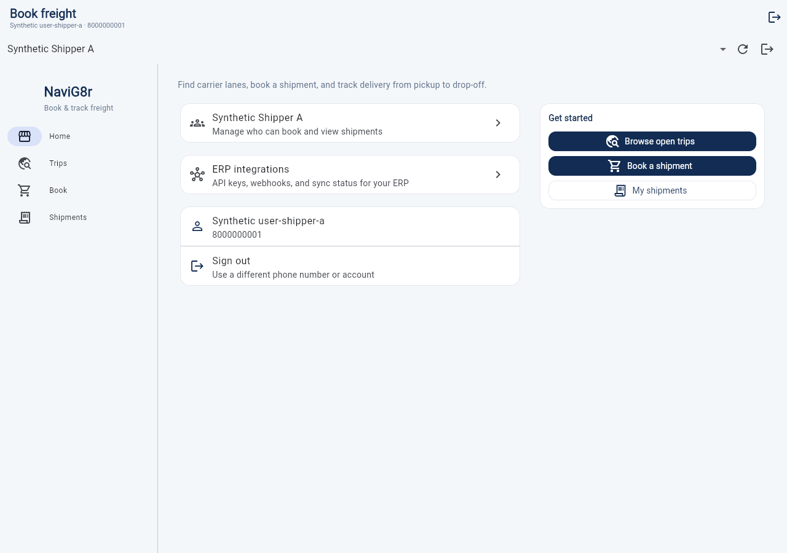

### 2. Browse open lanes

**Trips** opens **Find a lane**. **Browse open** lists carrier lanes with vehicle class, capacity, and a pickup window. **Book this lane** carries that trip into the booking form. **Match my route** is the second tab, for lanes that pass near a pickup and drop you enter.

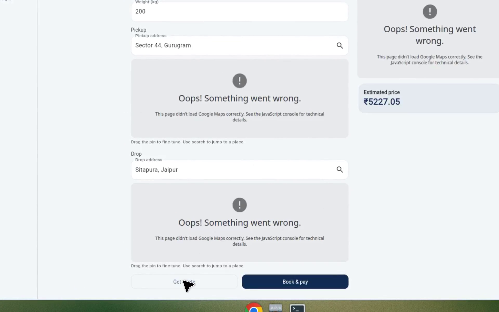

### 3. Quote, then book and pay

The booking form shows the lane, weight, pickup, and drop. **Get quote** returns an estimated price (₹5227.05 for 200 kg on the synthetic lane). **Book & pay** creates the shipment. With mock payments the charge is captured immediately and the app opens the shipment.

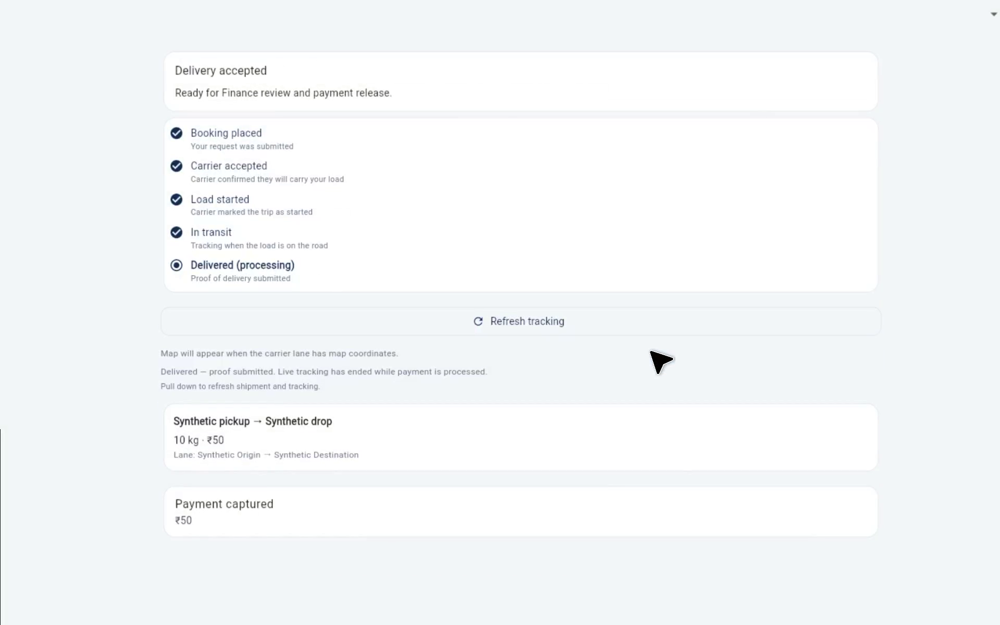

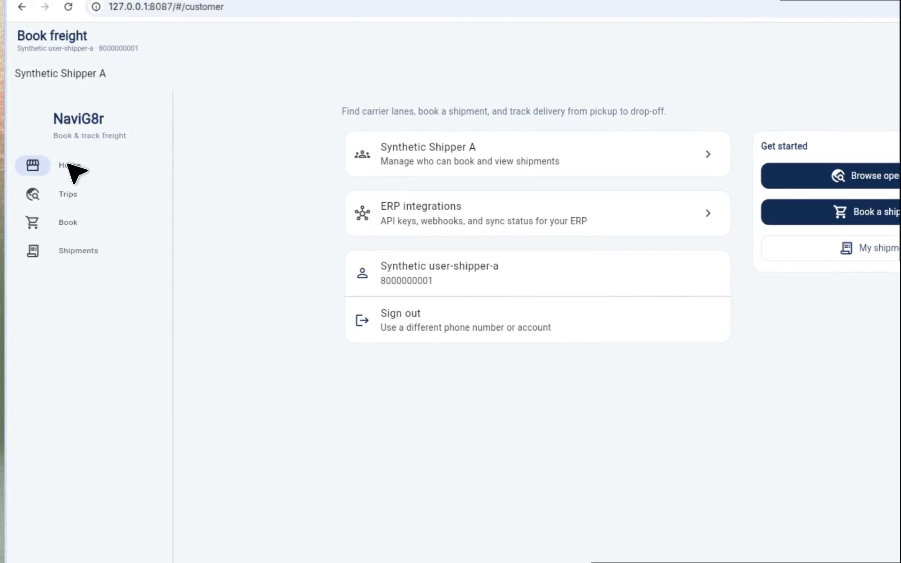

The new shipment shows the route, weight, price, a status timeline, and **Payment captured**. On this demo the carrier lane already had capacity reserved, so the timeline can read as waiting on the carrier or as carrier accepted, depending on the booking response.

### 4. My shipments

**Shipments** lists every load for the signed-in organization: the new booking plus older loads. Each row shows route, weight, and a status such as awaiting carrier acceptance or awaiting payment release.

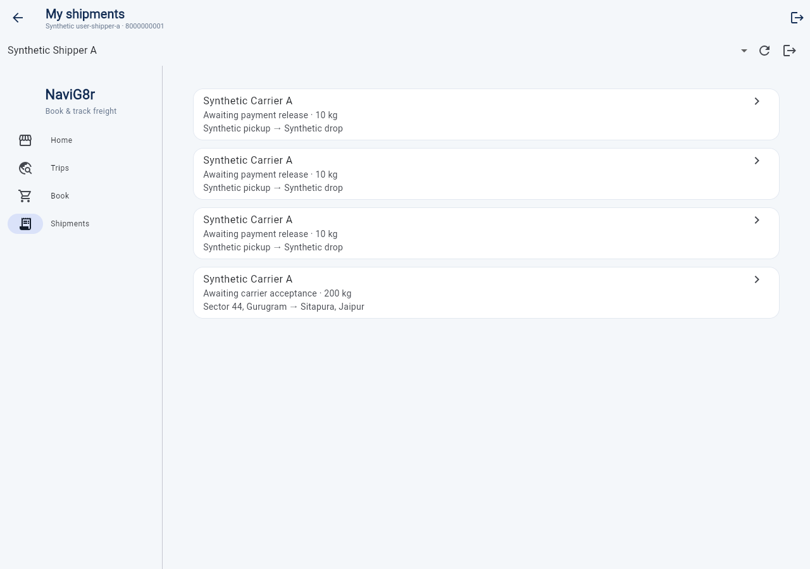

### 5. Accept delivery

Open a load whose proof of delivery is already in. The detail shows **Proof of delivery submitted** and the payment hold (shipper acceptance can end the 48-hour hold early). **Accept delivery** asks for confirmation. After confirm, the banner reads **Delivery accepted** and **Ready for Finance review and payment release.** The accept button goes away. Funds are not released from this screen. Finance does that in the operations portal.

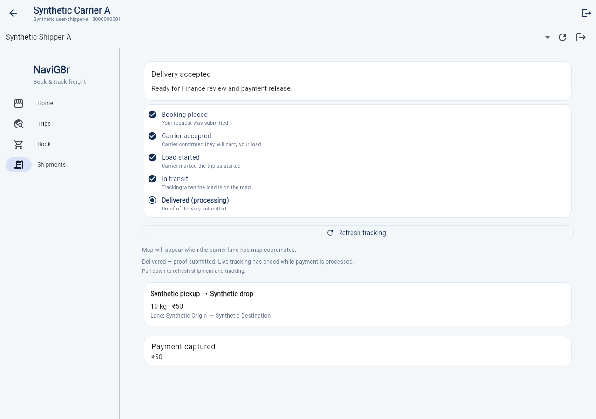

Tracking on the same screen refreshes the lane status. A live driver position appears after the carrier starts the trip and shares location.

### 6. Team

Org admins open the organization card on Home. **Team** invites a colleague by 10-digit phone and lists current members (admin and member).

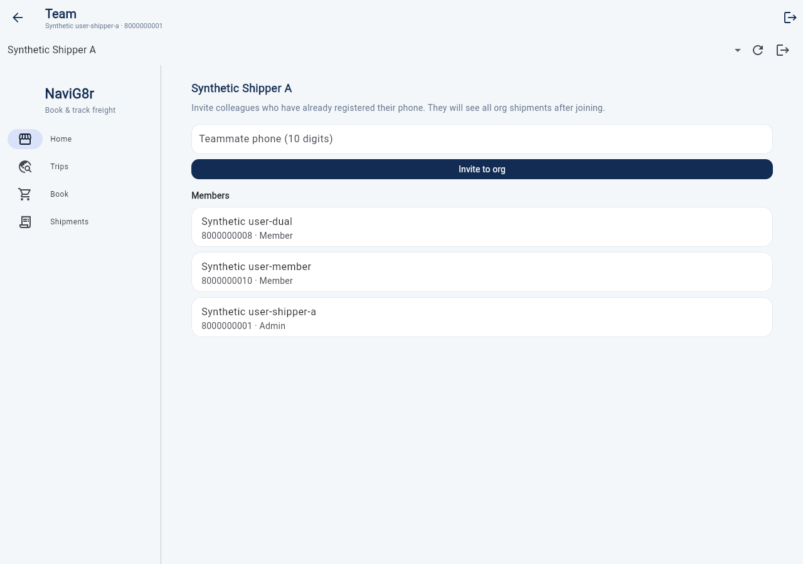

### 7. ERP integrations

**ERP integrations** on Home is also admin-only. It stores an HTTPS webhook callback, a payment policy (portal checkout via Razorpay in the customer web app), API keys, and recent webhook deliveries.

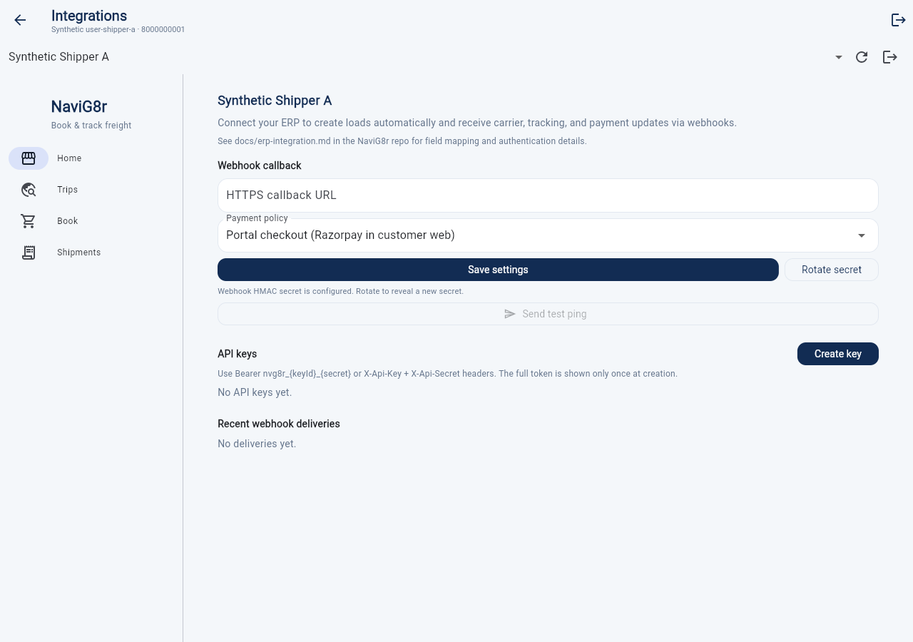

Other shipper entry points on the signed-out home: **Register business** and **Register as teammate**.

## Carrier

Carriers and drivers use the same app on `/#/driver`. After sign-in the bottom nav is Home, Shipments, Loads, Publish, and Profile.

### 1. Sign in

The welcome screen is **Driver & carrier**, with **Sign in with phone**, **Register as new carrier**, and **Join a carrier fleet**. Verify the SMS code on the next screen. An existing carrier owner lands on **Loads**.

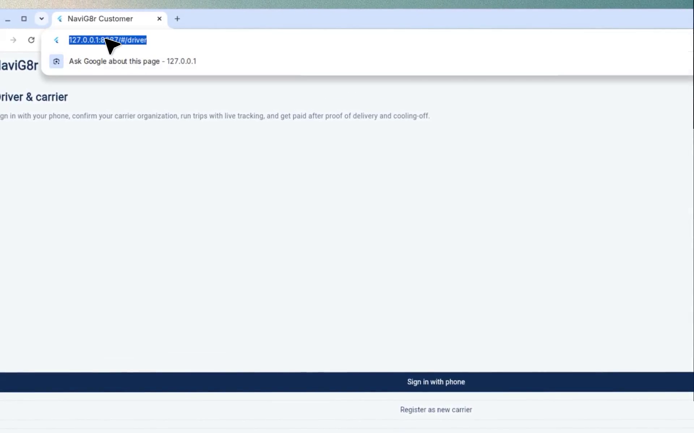

### 2. Start a load

Each load card shows the lane, vehicle class, how much capacity is left, and whether it has bookings. **Start** is available when the lane is open and at least one booking is accepted. Starting it shows **Load started — live tracking enabled** and the card switches to **In transit** with **Track**.

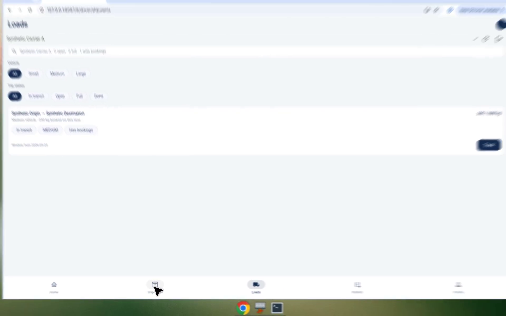

**Track** opens the active trip and posts location while that screen is open.

### 3. Shipments and accepting a booking

**Shipments** lists the carrier's loads: customer, route, weight, and status. A booking that still needs a yes shows **Accept**. Accepting confirms the carrier will carry it.

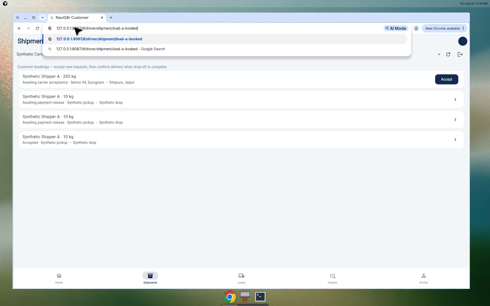

### 4. Confirm delivery

Open an accepted shipment and tap **Confirm delivery**. The proof-of-delivery screen explains that ops releases the customer payment to the carrier ledger after review. An optional note can be added, then **Confirm POD**. The success message is **Delivery confirmed. Payment will be released after ops review.**

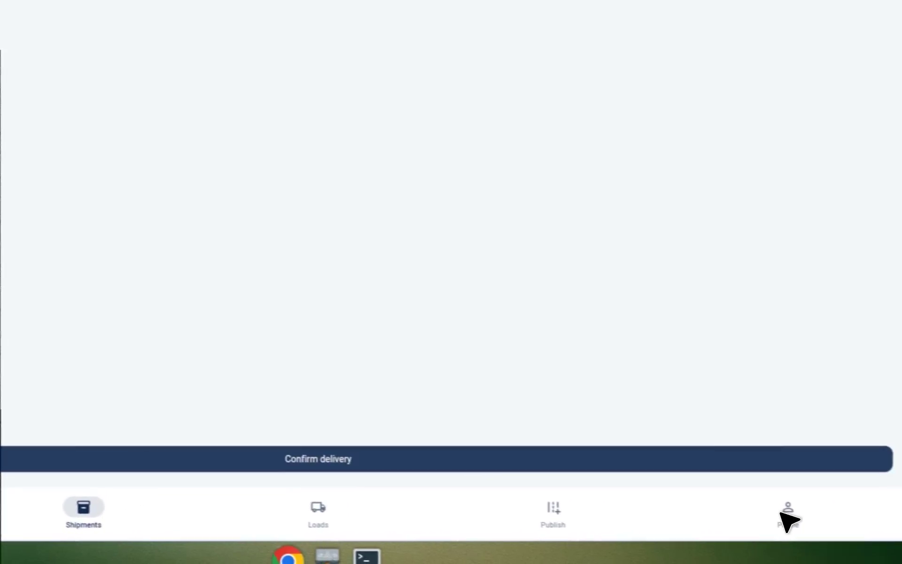

### 5. Profile, earnings, fleet, and publish

**Profile** shows the person, phone, and vehicle (registration, class, capacity) with **Save vehicle**. From here:

- **Earnings & payouts** shows pending accrued and paid out, compliance status, **Manage payout method**, and **Payout history**. On this demo both amounts are ₹0 because settlement waits on payment release and the weekly payout batch. Compliance for Synthetic Carrier A is **APPROVED**. Bank setup is a separate form and is not required for the mock demo.
- **Fleet — invite drivers** adds a driver or dispatcher who has already registered their phone.
- **Publish anchor trip** posts a lane (origin, destination, pickup window, vehicle class, capacity). The form opens with Gurugram → Jaipur, class MEDIUM, and 1000 kg, which you should replace before publishing a real lane.

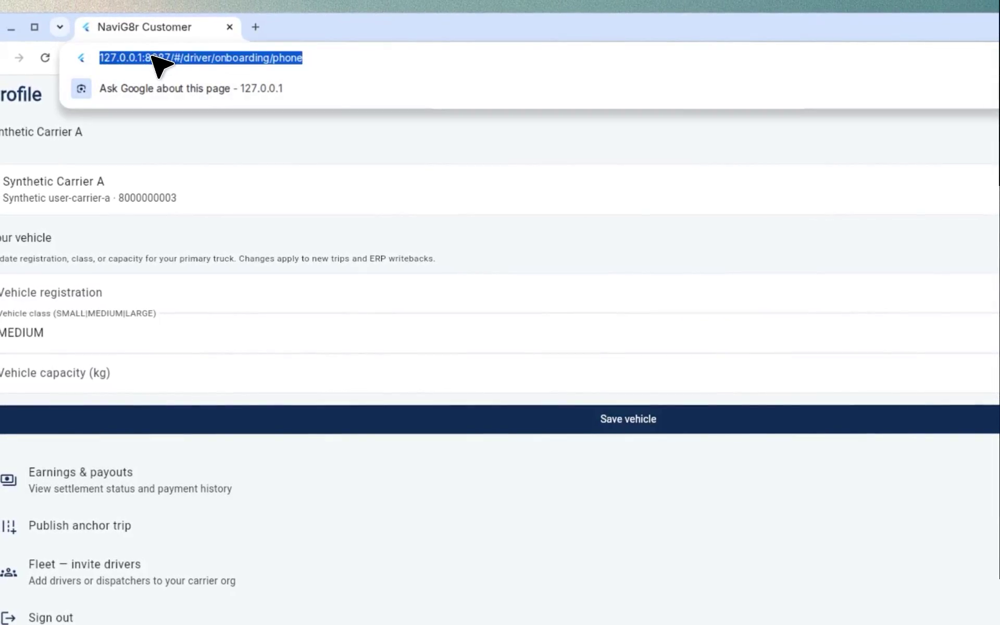

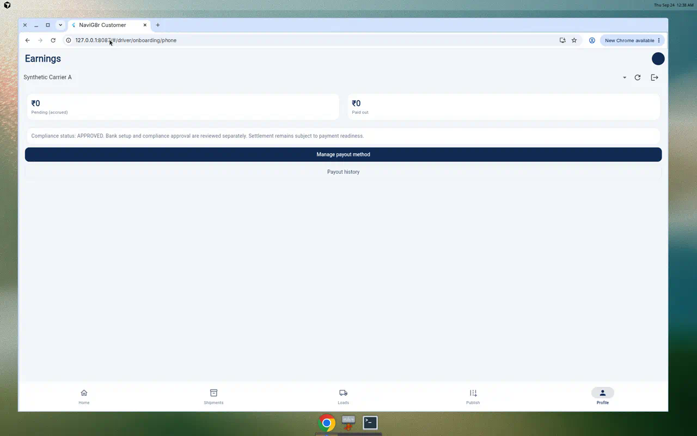

## How the two sides meet

1. Carrier publishes a lane (or already has one open).
2. Shipper browses or matches that lane, gets a quote, and books.
3. Carrier accepts the booking if it is still pending, then starts the load.
4. Carrier confirms delivery.
5. Shipper accepts delivery, which ends the payment hold early.
6. Finance releases payment from the operations portal. Carrier earnings move from pending to paid on the payout batch.

## What this pass did not walk on camera

- Registering a brand-new carrier business, and a driver joining a fleet before the owner adds them.
- Match-my-route search with a custom pickup and drop.
- Live GPS on the active trip (the screen is there; this machine has no device location).
- Submitting a new bank account on payout setup.
- The operations portal steps for compliance review and payment release (`docs/rbac-manual-testing.md`).
